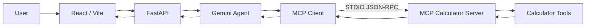
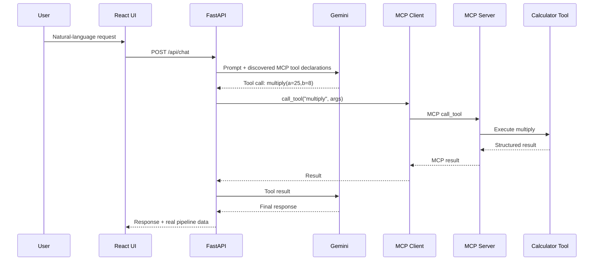

# Architecture

## Component diagram



## Request lifecycle



## Security boundaries

- Browser never receives `GEMINI_API_KEY`.
- Browser cannot choose an arbitrary MCP executable.
- Backend only invokes MCP tools that were discovered and are in the calculator allow-list.
- MCP server performs arithmetic independently of Gemini.
- User input is never executed as Python or shell code.

## Failure flow

```text
Gemini unavailable
      |
      v
Fallback intent parser
      |
      v
MCP tool invocation
      |
      +--> success -> final response
      |
      +--> failure -> controlled MCP error
```
